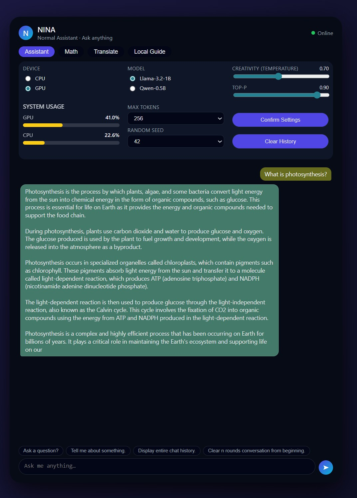

# NINA - A Lightweight Multi-Mode LLM System for Low Resource Deployment

Large Language Models (LLMs) have demonstrated impressive general-purpose reasoning and conversational abilities. However, their computational cost restricts deployment on low-resource devices. This project presents **NINA**, a lightweight, modular AI system that operates using **very small local models (1B parameters and below)** while offering functionality typically associated with larger architectures. The system integrates four independent modes: a *general assistant*, a symbolic-supported *math solver*, a multi-language *translator* and a real-time *local guide* capable of retrieving weather, news, tourism and flight information. 

The motivation behind **NINA** is to investigate whether **useful and reliable AI functionality can be achieved using only very small local models**, typically running on consumer-grade hardware such as a laptop GPU with **4 GB VRAM**. Through a combination of prompt engineering, hybrid symbolic reasoning, API-based retrieval, tight memory control and deterministic validation layers, **NINA** demonstrates that meaningful, practical AI systems can be built even without heavily constrained models and hardware. The project highlights challenges in inference stability, hallucination control, context window management, multimodal integration and proposes strategies to address each of them.
<p align="center">   </p>

---


## Core Capabilities:
NINA provides four primary operational modes:
### 1️. General Assistant
A lightweight instruction-tuned model (**Llama-3.2-1B-Instruct** or **Qwen-1.5-0.5B-Chat**) used for general queries, reasoning and conversational utilities.

**Features**
- Local inference (CPU/GPU auto-detection)
- Controlled context growth with history trimming
- VRAM-aware prompt caps
- Deterministic operation via configurable seeds and parameters
- Safe generation safeguards

##
### 2️. Math Solver
A hybrid computation module combining model-driven reasoning with symbolic mathematics.

**Features**
- Arithmetic and algebraic evaluation
- Geometry and measurement problems
- Basic statistics
- Word problem interpretation
- Safe symbolic computation via SymPy
- Clear separation between reasoning and exact calculation

##
### 3️. Translator
A structured translation module supporting more than 20 languages.

**Features**
- Strict translation behavior enforced through system prompting
- Controlled output (no explanatory augmentation)
- Language pair selection and mid-conversation reconfiguration
- Input length controls to maintain performance stability

##
### 4️. Local Guide
A location-aware information retrieval module integrating external data APIs and offline datasets.

**Capabilities include**
- Weather information (OpenWeatherMap)
- News summaries (GNews)
- Tourist locations, supermarkets and hotels (Geoapify Places)
- Flight information (AviationStack)
- Automatic city detection from user input
- Intent classification for routing requests
- Local airport code resolution via offline airport dataset

**Example Queries**
- “I want to visit places in Berlin.”
- “Where can I buy groceries in Frankfurt?”
- “Find hotels in Munich.”
- “Show flights from FRA to JFK.”

---


## Technology Stack:
### 1. Language Models
* **Llama-3.2-1B-Instruct** (primary model across all modes)
* **Qwen-1.5-0.5B-Chat** (optional alternative)
* Both loaded in **4-bit quantization** to operate within 4 GB VRAM.

##
### 2. Programming Environment
* Python 3.10+
* Libraries:
   * torch
   * transformers
   * bitsandbytes
   * huggingface_hub
   * flask
   * python-dotenv
   * requests
   * psutil

##
### 3. External Data Sources
* **OpenWeatherMap** – weather forecasts
* **GNews** – news headlines
* **Geoapify Places API** – tourist attractions, supermarkets, hotels
* **AviationStack API** – flight data
* **OpenFlights Airport Dataset** – IATA code resolution

---


## System Architecture:
NINA is designed as a modular multi-mode system, where each mode is an independently executed Python module:
```
NINA/
├── models/
├── static/
├── templates/
├── basefunctions.py
├── airports.json
├── app.py
├── basefunctions.py
├── download_models.py
├── multi_modes.py
├── normal_mode.py
├── requirements.txt
└── system_prompts.json
```

### 1. Shared Framework
Core features shared across all modes include:
* GPU/CPU automatic selection
* VRAM-aware prompt size estimation
* Output token tracking
* History trimming to avoid OOM errors
* Prompt construction and system message enforcement
* Safe fallback mechanisms during CUDA memory exhaustion

##
### 2. Mode Isolation

Each mode maintains:
* its own system prompt
* its own input loop
* its own inference history
* customized input/output constraints
* validation logic specific to its task

This isolation ensures robustness and prevents cross-contamination between different functionalities.

---

## Installation:
## 1. Clone the repository
```
https://github.com/mehedihassanarman/NINA.git
cd NINA
```

## 2. Configure API keys
First create accounts for getting API Keys from [OpenWeather](https://openweathermap.org/api), [GNews](https://gnews.io/), [Geoapify](https://www.geoapify.com/places-api), [Aviationstack](https://aviationstack.com/).
Then update **.env** file with your API Keys:
```
OPENWEATHER_API_KEY=
GNEWS_API_KEY=
GEOAPIFY_API_KEY=
AVIATIONSTACK_API_KEY=
```

## 3. Install dependencies
```
pip install -r requirements.txt
```

## 4. Model access and download
Before downloading the models, you must accept their licenses on Hugging Face:
* [Llama-3.2-1B-Instruct](https://huggingface.co/meta-llama/Llama-3.2-1B-Instruct)
* [Qwen-1.5-0.5B-Chat](https://huggingface.co/Qwen/Qwen1.5-0.5B-Chat)

### Step 1: Log in to Hugging Face (CLI)
Generate an access token from your [Hugging Face](https://huggingface.co/settings/tokens) account and run:
```
hf auth login --token your_token
```

### Step 2: Download the models
```
python download_models.py
```

## 5. Run the app
```
python app.py
```

